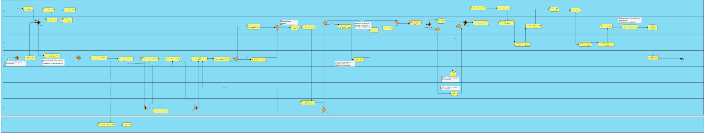
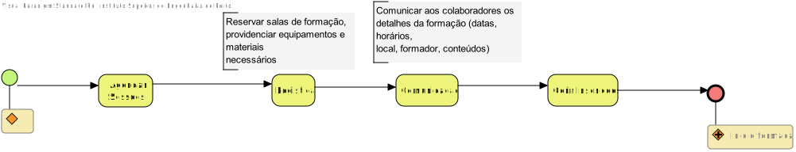
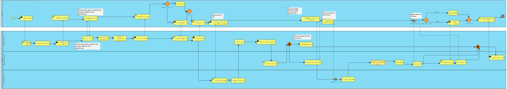
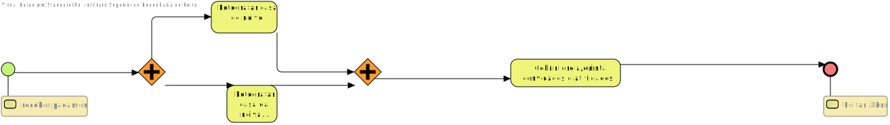
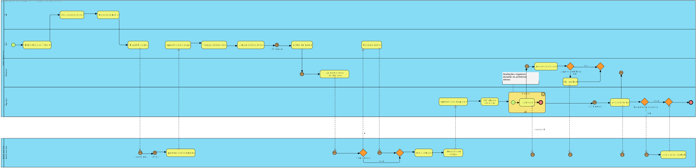
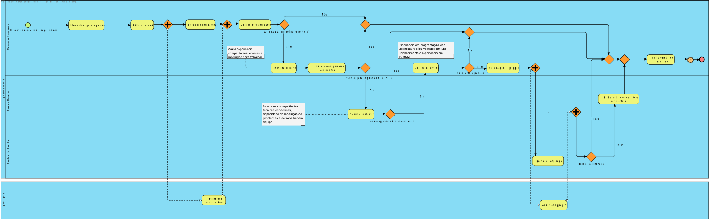
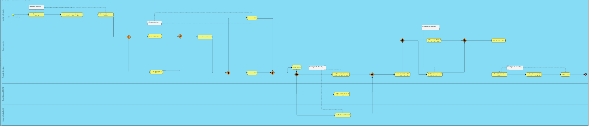
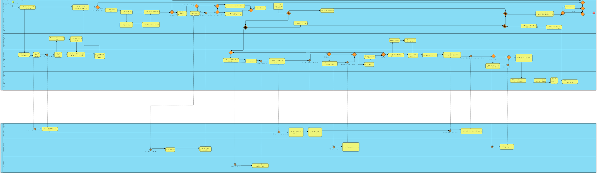
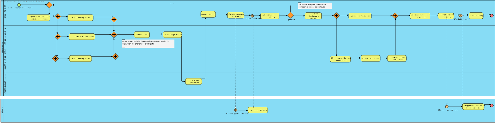

# Formação Interna

## Atores Envolvidos

- **Gestor de Recursos Humanos (RH):**  
  Responsável pela coordenação geral do processo de formação, desde a identificação das necessidades até à avaliação dos resultados.

- **Gestores de Departamento:**  
  Responsáveis por identificar as necessidades de formação das suas equipas e colaborar na definição dos conteúdos e objetivos da formação.

- **Colaboradores:**  
  Participam na identificação das suas necessidades de formação e avaliam a qualidade da formação recebida.

- **Formadores Internos:**  
  Colaboradores com conhecimentos especializados que podem partilhar com os colegas.

- **Formadores Externos:**  
  Empresas ou consultores especializados contratados para fornecer formação específica.

- **Direção Executiva:**  
  Aprova o orçamento e a estratégia de formação.

---

## Geral

## Preparar Formação

## Análise Final

# Casamento

## Atores Envolvidos

- **Gestor de Clientes:**  
  Responsável pela coordenação geral e acompanhamento do processo, é a ligação direta entre empresa e clientes.

- **Equipa de Fotografia:**  
  Responsáveis pela cobertura do casamento, tanto fotográfica como em vídeo, além da edição e envio do trabalho final. Também realizam a sessão de solteiros com o casal.

- **Departamento Financeiro:**  
  Responsáveis pelos pagamentos e envio das faturas ao gestor de clientes.

- **Casal:**  
  Aprova orçamento e trabalho final.

---

## Geral

## Cobertura Casamento

---

# Integração Novo Elemento

## Atores Envolvidos

- **Colaborador:**  
  O novo colaborador que foi contratado.

- **Equipa:**  
  A equipa que o novo colaborador vai integrar.

- **Mentor:**  
  A pessoa responsável que vai mentorar o novo colaborador.

- **RH:**  
  A equipa de recursos humanos da empresa.

- **IT:**  
  A equipa de IT da empresa que vai ser responsável pela criação dos acessos do novo colaborador, assim como a atribuição de equipamento.

---

## Geral

---

# Recrutamento

## Geral

---

# Plano de Marketing

## Atores Envolvidos

- **Analista de Marketing**
- **Direção Executiva**
- **Gestor de Marketing**
- **Especialista em SEO/SEM**
- **Gestor de Redes Sociais**

---

## Geral

---

# Expansão

## Atores Envolvidos

- **Direção Executiva** – Responsável pela aprovação e supervisão da estratégia de expansão.
- **Departamento Financeiro** – Responsável pela análise financeira, orçamentação e controlo de custos da expansão.
- **Departamento Jurídico** – Responsável pela análise legal e regulatória dos mercados alvo.
- **Departamento de Marketing Internacional** – Responsável pela adaptação das campanhas de marketing aos mercados internacionais.
- **Departamento de Operações e Logística**
- **Consultores Externos de Expansão** – Especialistas externos contratados para fornecer orientação e suporte na expansão.
- **Parceiros Locais** – Empresas ou indivíduos nos mercados-alvo que podem auxiliar na entrada e operação.
- **Tradutores** – Responsáveis pela tradução e adaptação de materiais de marketing e comunicação.

---

## Geral

---

# Postagem

## Atores Envolvidos

- **Gestor de Marketing** – Responsável pela supervisão geral do processo de marketing, desde o planeamento até à execução e análise.
- **Especialista em SEO/SEM** – Responsável pela otimização de conteúdos para motores de busca e gestão de campanhas de publicidade online.
- **Criador de Conteúdo (Copywriter, Designer Gráfico, Videógrafo)** – Responsável pela produção de conteúdos de alta qualidade para diferentes canais de marketing.
- **Gestor de Redes Sociais (Community Manager)** – Responsável pela gestão das redes sociais, interação com a comunidade e programação de posts.
- **Cliente (ou representante)** – Fornece feedback e aprovação em cada etapa do processo.

---

## Geral

